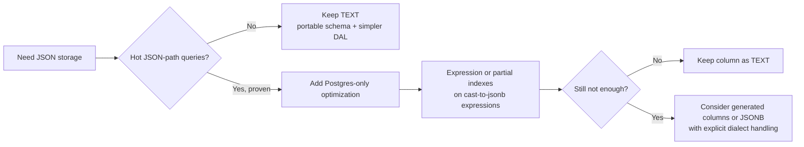

# Postgres JSON fields: JSONB vs TEXT

This is a reference note for one specific schema decision: why several JSON-heavy columns stay `TEXT` even on Postgres.

## Quick orientation

- **Read this if:** you are considering `JSONB`, generated columns, or Postgres-specific JSON indexes.
- **Skip this if:** you only need the general dialect contract.
- **Go deeper:** use [StateStore dialects](/architecture/gateway/statestore-dialects) for the broader policy and [DB JSON hygiene](/architecture/db-json-hygiene) for shape/default rules.

## Current decision

Keep the evaluated columns as `TEXT` for now.

## Why `TEXT` still wins today

| Question                                                      | Current answer                                                                          |
| ------------------------------------------------------------- | --------------------------------------------------------------------------------------- |
| Are these columns queried by JSON path in hot operator flows? | No. They are usually read by id/revision and validated in the gateway.                  |
| Would `JSONB` improve correctness today?                      | Not materially.                                                                         |
| Would `JSONB` add cost?                                       | Yes. It introduces dialect handling in DALs and changes textual preservation semantics. |
| What immediate integrity gain do we still want?               | JSON-validity checks on high-value `TEXT` columns.                                      |

## Evaluated columns

| Column                         | Why it was considered                                                          |
| ------------------------------ | ------------------------------------------------------------------------------ |
| `policy_snapshots.bundle_json` | Policy bundles are large and structured.                                       |
| `routing_configs.config_json`  | Routing config may eventually attract targeted filtering.                      |
| `watchers.trigger_config_json` | Watcher configs are structured but not currently queried by path in hot flows. |

## Practical trade-off

## Integrity rules

- SQLite uses `CHECK (json_valid(...))`.
- Postgres uses `CHECK (pg_input_is_valid(..., 'jsonb'))`.
- These checks were added in the v2 rebuild migrations; older already-migrated databases do not retroactively gain them without rebuild/migration work.

## When to revisit

Revisit a `JSONB`-native design only when all of these are true:

1. There is a concrete operator or audit query filtering on JSON keys.
2. The query is frequent or expensive enough to justify Postgres-only optimization.
3. The DAL and migration divergence is acceptable and documented.

## Preferred optimization order

1. Expression or partial indexes on `(text_column::jsonb ->> 'key')`.
2. Generated columns if expression indexes are insufficient.
3. `JSONB` column types only with explicit statestore-layer handling and updated docs.

## Related docs

- [StateStore dialects](/architecture/gateway/statestore-dialects)
- [DB JSON hygiene](/architecture/db-json-hygiene)
- [Gateway data model map (v2)](/architecture/data-model-map)
