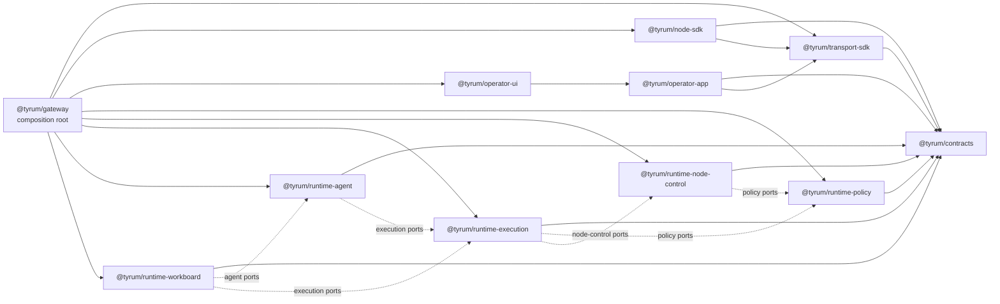

# Target-state package graph

This overview is the live contributor contract for Tyrum's package graph.

## Quick orientation

- **Read this if:** you are deciding where new code, imports, or package moves should land.
- **Skip this if:** you need the current extraction status; use [Runtime extraction parity map](/architecture/runtime-extraction-parity).
- **Go deeper:** use [Runtime extraction parity map](/architecture/runtime-extraction-parity) for the current ownership bridge, then [ARCH-01 clean-break target-state decision record](./reference/arch-01-clean-break-target-state.md) for the why and the subsystem docs for mechanics.

## Clean-break rule

- No backwards-compatibility shims.
- `@tyrum/gateway` remains the public runtime and binary, but only as composition root, transport adapters, bootstrap, and bundled operator asset serving.

## Target package graph

## Target packages

- `@tyrum/contracts`: the only shared contract package for wire protocol, DTOs, schemas, and generated contract artifacts.
- `@tyrum/transport-sdk`: typed HTTP and WebSocket transport behavior plus transport conformance tests only.
- `@tyrum/node-sdk`: generic node lifecycle, identity, capability registration, and dispatch plumbing.
- `@tyrum/operator-app`: the shared app-facing operator layer; it owns operator-side actions and state without exposing raw transport primitives.
- `@tyrum/operator-ui`: reusable operator UI components and pages that depend on `@tyrum/operator-app` and shared contracts.
- `@tyrum/runtime-policy`: policy evaluation, overrides, approvals, and review policy logic behind injected ports.
- `@tyrum/runtime-node-control`: node pairing, inventory, readiness, and dispatch coordination behind injected ports.
- `@tyrum/runtime-execution`: execution orchestration, step execution, and task-result plumbing through policy and node-control ports.
- `@tyrum/runtime-agent`: agent runtime, registry, context assembly, and turn orchestration through execution ports.
- `@tyrum/runtime-workboard`: durable workboard orchestration, delegated work coordination, and subagent/work leasing flows through agent and execution ports.
- `@tyrum/gateway`: the public runtime entrypoint and composition root that wires the target packages together and serves bundled operator assets.

## Allowed dependency directions

| Layer                     | Packages                                                                                                                               | Allowed dependency directions                                                                                                                                                                                                                     | Must not depend on                                                                 |
| ------------------------- | -------------------------------------------------------------------------------------------------------------------------------------- | ------------------------------------------------------------------------------------------------------------------------------------------------------------------------------------------------------------------------------------------------- | ---------------------------------------------------------------------------------- |
| Contracts                 | `@tyrum/contracts`                                                                                                                     | No workspace-package dependencies.                                                                                                                                                                                                                | Any other workspace package.                                                       |
| SDKs and app-facing state | `@tyrum/transport-sdk`, `@tyrum/node-sdk`, `@tyrum/operator-app`                                                                       | Point inward to `@tyrum/contracts`; `@tyrum/node-sdk` may also depend on `@tyrum/transport-sdk`; `@tyrum/operator-app` may also depend on `@tyrum/transport-sdk`.                                                                                 | `@tyrum/gateway`, runtime packages, or presentation code.                          |
| Presentation              | `@tyrum/operator-ui`                                                                                                                   | Depends on `@tyrum/operator-app` and `@tyrum/contracts`.                                                                                                                                                                                          | `@tyrum/transport-sdk`, `@tyrum/node-sdk`, runtime packages, and `@tyrum/gateway`. |
| Runtime domains           | `@tyrum/runtime-policy`, `@tyrum/runtime-node-control`, `@tyrum/runtime-execution`, `@tyrum/runtime-agent`, `@tyrum/runtime-workboard` | Point inward to `@tyrum/contracts` and to peer runtime packages only through explicit ports and interfaces. Approved runtime directions today are execution to policy and node-control, agent to execution, and workboard to agent and execution. | Operator packages and `@tyrum/gateway` internals.                                  |
| Composition root          | `@tyrum/gateway`                                                                                                                       | May compose any target package, host transport adapters, and serve bundled operator assets. Route and WebSocket handlers stop at auth, parsing, and translation.                                                                                  | Owning business logic, DAL-heavy orchestration, or new cross-package contracts.    |

## Contributor rules

1. Choose the target package or layer first and state it in the PR.
2. New transport behavior belongs in `@tyrum/transport-sdk`, not in `@tyrum/operator-ui` or gateway route handlers.
3. New node lifecycle and capability wiring belongs in `@tyrum/node-sdk`.
4. New operator behavior belongs in `@tyrum/operator-app`, while reusable UI stays in `@tyrum/operator-ui`.
5. New runtime and business logic belongs in the runtime packages behind explicit ports; `@tyrum/gateway` stays the composition root.

## Boundary check maintenance

- Run `pnpm lint:boundaries` locally to evaluate the workspace boundary gate directly. `pnpm lint` includes the same check and CI gates merges through that normal lint step.
- Keep `scripts/lint/package-boundaries.config.mjs` in sync with this page and [ARCH-01 clean-break target-state decision record](./reference/arch-01-clean-break-target-state.md). Update the doc and the executable rule set together in the same PR.

## Related docs

- [Architecture overview](/architecture)
- [Runtime extraction parity map](/architecture/runtime-extraction-parity)
- [Gateway](/architecture/gateway)
- [ARCH-01 clean-break target-state decision record](./reference/arch-01-clean-break-target-state.md)
