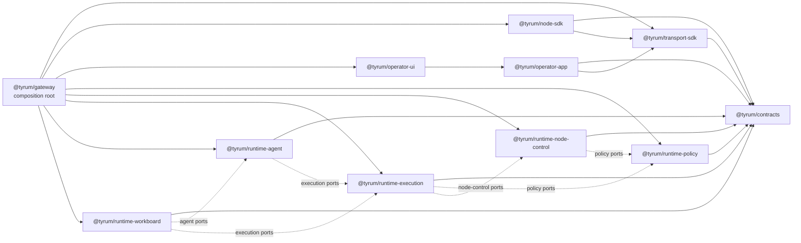

# Target-state package graph

This overview is the contributor contract for Tyrum's clean-break package migration.

## Quick orientation

- **Read this if:** you are deciding where new code, imports, or package moves should land during the architecture untangle.
- **Skip this if:** you only need the current runtime map; start with [Architecture overview](/architecture) for that.
- **Go deeper:** use [ARCH-01 clean-break target-state decision record](./reference/arch-01-clean-break-target-state.md) for the why, then the subsystem docs for mechanics.

## Clean-break rule

- No backwards-compatibility shims.
- No new code against legacy packages once the replacement migration issue for that concern is open.
- Temporary coexistence is allowed only for the migration window needed to land the linked issue safely.
- `@tyrum/gateway` remains the public runtime and binary, but only as composition root, transport adapters, bootstrap, and bundled operator asset serving.

## Target package graph

## Target packages

- `@tyrum/contracts`: the only shared contract package for wire protocol, DTOs, schemas, and generated contract artifacts.
- `@tyrum/transport-sdk`: typed HTTP and WebSocket transport behavior plus transport conformance tests only.
- `@tyrum/node-sdk`: generic node lifecycle, identity, capability registration, and dispatch plumbing.
- `@tyrum/operator-app`: the shared app-facing operator layer; it owns operator-side actions and state without exposing raw transport primitives.
- `@tyrum/operator-ui`: presentation-only components and pages that depend on `@tyrum/operator-app`.
- `@tyrum/runtime-policy`: policy evaluation, overrides, approvals, and review policy logic behind injected ports.
- `@tyrum/runtime-node-control`: node pairing, inventory, readiness, and dispatch coordination behind injected ports.
- `@tyrum/runtime-execution`: execution orchestration, step execution, and task-result plumbing through policy and node-control ports.
- `@tyrum/runtime-agent`: agent runtime, registry, context assembly, and turn orchestration through execution ports.
- `@tyrum/runtime-workboard`: durable workboard orchestration, delegated work coordination, and subagent/work leasing flows through agent and execution ports.
- `@tyrum/gateway`: the public runtime entrypoint and composition root that wires the target packages together and serves bundled operator assets.

## Allowed dependency directions

| Layer                     | Packages                                                                                                                               | Allowed dependency directions                                                                                                                                                                                                                     | Must not depend on                                                                                  |
| ------------------------- | -------------------------------------------------------------------------------------------------------------------------------------- | ------------------------------------------------------------------------------------------------------------------------------------------------------------------------------------------------------------------------------------------------- | --------------------------------------------------------------------------------------------------- |
| Contracts                 | `@tyrum/contracts`                                                                                                                     | No workspace-package dependencies.                                                                                                                                                                                                                | Any target or legacy workspace package.                                                             |
| SDKs and app-facing state | `@tyrum/transport-sdk`, `@tyrum/node-sdk`, `@tyrum/operator-app`                                                                       | Point inward to `@tyrum/contracts`; `@tyrum/node-sdk` may also depend on `@tyrum/transport-sdk`; `@tyrum/operator-app` may also depend on `@tyrum/transport-sdk`.                                                                                 | `@tyrum/gateway`, `@tyrum/operator-ui`, runtime packages, and legacy packages.                      |
| Presentation              | `@tyrum/operator-ui`                                                                                                                   | Depends on `@tyrum/operator-app` only.                                                                                                                                                                                                            | `@tyrum/transport-sdk`, `@tyrum/node-sdk`, runtime packages, `@tyrum/gateway`, and legacy packages. |
| Runtime domains           | `@tyrum/runtime-policy`, `@tyrum/runtime-node-control`, `@tyrum/runtime-execution`, `@tyrum/runtime-agent`, `@tyrum/runtime-workboard` | Point inward to `@tyrum/contracts` and to peer runtime packages only through explicit ports and interfaces. Approved runtime directions today are execution to policy and node-control, agent to execution, and workboard to agent and execution. | Operator packages, `@tyrum/gateway` internals, and legacy packages.                                 |
| Composition root          | `@tyrum/gateway`                                                                                                                       | May compose any target package, host transport adapters, and serve bundled operator assets. Route and WebSocket handlers stop at auth, parsing, and translation.                                                                                  | Owning business logic, DAL-heavy orchestration, or new cross-package contracts.                     |

## Legacy packages on the way out

| Current package                           | Target replacement                                                     | Contributor rule                                                                                                     |
| ----------------------------------------- | ---------------------------------------------------------------------- | -------------------------------------------------------------------------------------------------------------------- |
| `@tyrum/client`                           | `@tyrum/transport-sdk` and `@tyrum/node-sdk`                           | Do not add new transport or generic node APIs here unless the active migration step requires temporary coexistence.  |
| `@tyrum/operator-core`                    | `@tyrum/operator-app`                                                  | Do not add new app-facing operator state or actions to the legacy package after the replacement track is open.       |
| `@tyrum/operator-ui` (current mixed role) | `@tyrum/operator-ui` presentation-only on top of `@tyrum/operator-app` | New UI behavior must arrive through `@tyrum/operator-app`, not by reaching through to transport or runtime packages. |
| `@tyrum/gateway` (current monolith)       | `@tyrum/gateway` composition root plus `@tyrum/runtime-*` packages     | Keep new business logic out of gateway handlers and services.                                                        |

## Migration rules for new work

1. Choose the target package or layer first and state it in the PR.
2. If the target package does not exist yet, land the smallest migration slice that creates it instead of extending the legacy surface as a shortcut.
3. Touch a legacy package only when it is strictly required for the linked migration step or to keep the repo green during temporary coexistence.
4. New transport behavior belongs in `@tyrum/transport-sdk`, not in `@tyrum/operator-ui` or gateway route handlers.
5. New operator behavior belongs in `@tyrum/operator-app`; `@tyrum/operator-ui` stays presentation-only.
6. New runtime and business logic belongs in the runtime packages behind explicit ports; `@tyrum/gateway` stays the composition root.

## Boundary check maintenance

- Run `pnpm lint:boundaries` locally to evaluate the workspace boundary gate directly. `pnpm lint` includes the same check and CI gates merges through that normal lint step.
- Keep `scripts/lint/package-boundaries.config.mjs` in sync with this page and [ARCH-01 clean-break target-state decision record](./reference/arch-01-clean-break-target-state.md). Update the doc and the executable rule set together in the same PR.
- Use `scripts/lint/package-boundaries-baseline.json` only for temporary coexistence entries that are still required to land the linked migration issue safely. Every allowlist entry should carry a linked issue in the `reason`, and it should be removed as soon as the migration step lands.
- `#1535` temporarily allowlists the current `@tyrum/operator-ui -> @tyrum/contracts` edges so the contracts-package rename can land before the separate `@tyrum/operator-app` extraction removes direct contract usage from presentation code.
- `#1538` temporarily allowlists the initial `@tyrum/operator-app` extraction where helper entrypoints and a small set of downstream consumers still depend on `@tyrum/client` or `@tyrum/node-sdk` during the package move.
- When a replacement package first appears, add only the minimum coexistence allowlist entries needed to keep the repo green. The boundary gate should then block any new legacy-package edges outside that explicit baseline.

## Related docs

- [Architecture overview](/architecture)
- [Gateway](/architecture/gateway)
- [ARCH-01 clean-break target-state decision record](./reference/arch-01-clean-break-target-state.md)
