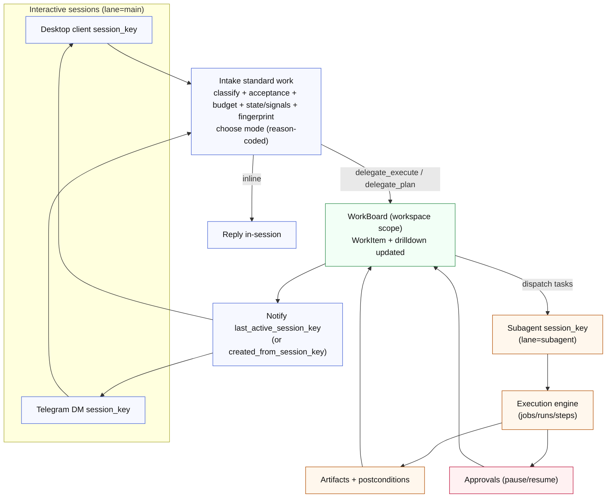
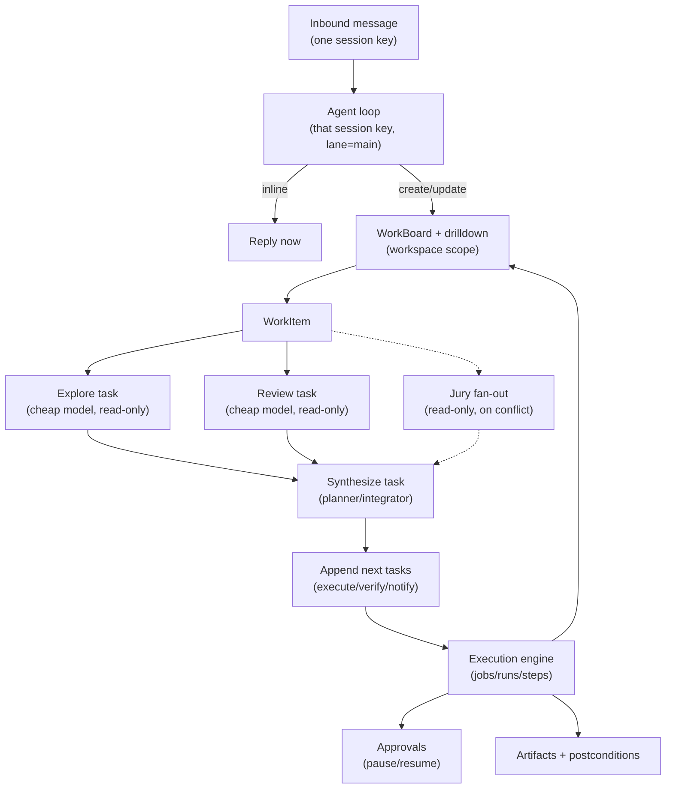
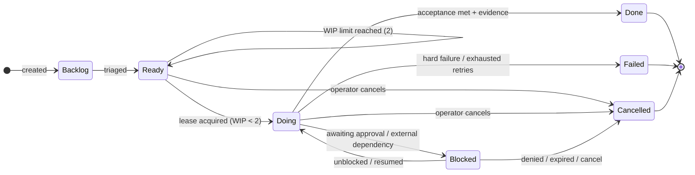

# Work board and delegated execution

The WorkBoard is Tyrum's workspace-scoped backlog and work-tracking system. It exists to keep interactive sessions (chat, and future low-latency audio) responsive while long-running work is planned and executed in the background.

## Status

- **Status:** Partially Implemented

## Current State

- The gateway persists WorkItems and related drilldown data and exposes WorkBoard APIs.
- The desktop app exposes a WorkBoard UI (Kanban + drilldown).
- The web operator UI, CLI, and TUI do not yet provide full WorkBoard management (planned).

The WorkBoard is a Kanban view over durable work state. A WorkItem can contain an internal task graph (a DAG) that the planning loop updates and the execution engine executes.

## Goals

- Keep channel-facing interactions low-latency by delegating long-running work to background runs/subagents.
- Make background work queryable from operator clients (desktop app today) and, over time, from channels (for example Telegram) without relying on a specific session transcript.
- Prevent "one mega task" by sizing WorkItems, enforcing WIP limits, and making consolidation explicit.
- Preserve Tyrum's safety model: approvals, postconditions, artifacts, idempotency, and policy enforcement remain the enforcement layer.

## Non-goals

- Multi-operator coordination. Starting assumption: one operator per agent.
- Autonomous "learning" beyond explicit operator configuration.
- Replacing the execution engine. The WorkBoard sits above jobs/runs/steps as the work-management layer.

## Key concepts

### WorkBoard (workspace-scoped Kanban)

A WorkBoard is a durable backlog scoped to `(tenant_id, agent_id, workspace_id)`.

- It tracks WorkItems and their current state (Backlog/Ready/Doing/Blocked/Done/Cancelled).
- It enforces a WIP limit for `Doing` items (starting default: `2`).
- It is the primary place the interactive agent loop consults to answer "what are you working on?" and "status?" from any channel.

Kanban is a representation. The engine runs jobs/runs; planning tasks update task graphs; the board summarizes outcomes and blockers.

### WorkBoard drilldown (global workspace)

The WorkBoard is also Tyrum's **global workspace** surface: a durable, operator-inspectable "blackboard" that records the evolving working set behind long-running work.

To keep the default experience simple, the WorkBoard has two layers:

- **Summary (default):** Kanban columns + "what's next / what's blocked".
- **Drilldown:** typed artifacts, decisions, reminders, and evidence links for a WorkItem (and optionally for the workspace).

This lets the system offload commitments and intermediate reasoning to durable state (so it survives interruptions and context compaction) while keeping the top-level UI clean.

### WorkArtifact (blackboard item)

A WorkArtifact is a typed, durable record attached to a WorkItem (or to the workspace) that captures intermediate planning/execution state.

Common kinds:

- `candidate_plan` (proposed steps, budgets, risks)
- `hypothesis` (assumptions to validate)
- `risk` (hazards, mitigations, rollback notes)
- `tool_intent` (why a tool call is justified and what evidence is expected)
- `verification_report` (postconditions, checks, failures)
- `jury_opinion` (read-only subagent analysis under conflict)
- `result_summary` (high-signal outcome summary with artifact links)

WorkArtifacts are **not transcripts**. They should reference durable identifiers (runs/steps/approvals/artifacts) instead of copying large raw logs.

### DecisionRecord (what we chose and why)

A DecisionRecord captures a discrete choice made during planning/execution:

- the question being decided (for example "delegate vs inline", "which approach", "retry vs escalate"),
- the chosen option,
- considered alternatives,
- rationale and inputs (linked WorkArtifacts/evidence),
- who/what made the decision (run/subagent/profile).

DecisionRecords are the primary durable input for the "what changed and why?" drilldown experience.

### WorkSignal (prospective memory)

A WorkSignal is a durable reminder/trigger attached to a WorkItem or workspace. It represents "remember to do X later" as state, not as a hope about transcript recall.

Two trigger modes:

- **Time-based:** "at 3pm local, …" (harder for humans/agents to remember reliably without externalization)
- **Event-based:** "when approval resolves", "when artifact X appears", "when WorkItem enters Blocked", …

WorkSignals are evaluated by the scheduler/watchers and enqueue explicit work (update the WorkBoard, dispatch a verification step, notify the operator). Notifications remain policy-gated side effects.

### Work focus digest (focus-of-attention)

During context assembly, Tyrum derives a small, **budgeted Work focus digest** from durable work state (WorkBoard + canonical state KV) and injects it into the model context alongside the memory digest.

The focus digest is designed to be stable and low-noise:

- Always include: `Doing` WorkItems, blockers/approvals, current state KV (agent + active WorkItem), and the next runnable tasks for the active WorkItem.
- Fill remaining budget with: highest-priority `Ready` items and the most recent DecisionRecords and high-confidence WorkArtifacts.

This provides a reliable working set without requiring the model to hold a large plan in prompt history.

### Canonical work state (interference-resistant KV)

LLMs can suffer "latest-value" failures under interference even when older values are present in context. To prevent drift, Tyrum treats some state as **authoritative** and renders it in a stable form:

- **Agent state KV:** pinned preferences and constraints that must not oscillate.
- **WorkItem state KV:** current plan variables for a WorkItem (branch name, target env, recipients, deadlines, chosen approach).

When an operator or run updates a "current truth", it should be written to KV (with provenance) rather than relying on narrative recall.

### ToolIntent (metacognitive tool gating)

Tool calls are treated as deliberate actions with explicit intent, not as a reflex.

A ToolIntent records:

- the goal of a tool call,
- expected value and cost budget,
- risk/side-effect class,
- required evidence/postconditions (when applicable),
- the execution profile/tool allowlist constraints used.

ToolIntent is stored as a WorkArtifact (typically `kind=tool_intent`) and referenced from the dispatched tasks/steps that implement it.

### IntentGraph (intent and deviation checks)

For safety and anti-drift, Tyrum represents the intended outcome and constraints of a WorkItem as an **IntentGraph** derived from:

- acceptance criteria,
- approvals and policy outcomes,
- WorkItem state KV (authoritative "current truth"),
- the latest relevant DecisionRecords.

Before side-effecting execution proceeds, the system checks that the next action is consistent with the IntentGraph. If not, it pauses and escalates (clarification or approval) instead of "helpfully" acting outside intent.

### WorkItem (operator-facing unit of work)

A WorkItem is an operator-visible unit of work with a clear outcome and acceptance criteria.

WorkItems are sized to avoid the "everything merges into one card" failure mode:

- **Action WorkItem:** small, bounded, specific deliverable. Typically minutes to hours.
  - Example: "Schedule a meeting tomorrow morning with me and A."
- **Initiative WorkItem:** large and open-ended. It must be decomposed into smaller Action WorkItems before broad execution.
  - Example: "Implement this GitHub project end-to-end."

An Initiative WorkItem is allowed to produce a plan and spawn child WorkItems. It should not directly become a single sprawling fingerprint that absorbs unrelated work.

### Task graph (DAG) inside a WorkItem

Each WorkItem may have an internal task graph: nodes represent tasks, and edges represent dependencies.

- The planning loop creates and updates the graph as new information arrives.
- A work coordinator leases runnable tasks and dispatches them to an appropriate execution profile.
- Task completion is evidence-backed: artifacts + postconditions whenever feasible.
- A WorkItem's Kanban state is derived from the aggregate task state:
  - Blocked if any required approval is pending.
  - Doing if one or more tasks are leased/running.
  - Done only when acceptance checks pass and required evidence exists.

### Subagent (delegated execution context)

A subagent is a delegated execution context that shares the parent agent's identity boundary but has its own runtime context and transcript.

Starting semantics:

- Same `agent_id`, same workspace, same policy bundle and memory scope.
- Different `session_key` (so it does not serialize behind a channel-facing session).
- Subagent runs should normally execute in `lane=subagent`.
- An **execution profile** selects model, tool allowlist, budgets, and whether it is write-capable (distinct from provider auth profiles described in [Models](./models.md)).

In other words: a subagent is "the same agent, different session key + execution profile".

### Interactive agent loop (`lane=main`)

Each channel or client session has an interactive agent loop in `lane=main` that is tuned for responsiveness:

- It should reply quickly with either an inline answer or a WorkItem id.
- It should prefer delegation for tool-heavy or long-running work.
- It should answer status by querying WorkBoard state (not by replaying transcripts).
- It should rely on budgeted digests (Work focus + memory), not long transcript replay, to stay coherent under interruptions.

## Brain-inspired planning model (practical mapping)

Tyrum uses the brain as a **metaphor for useful system behaviors**, not as a neuroscience simulation. Planning is an emergent control loop across multiple subsystems — not a single “planner module”. In Tyrum docs and profiles, `planner` refers to an execution profile used for planning tasks, not a singleton component.

Practical mapping:

- **Working set (“working memory”):** the **Work focus digest** provides a small, budgeted "what matters now" slice of the WorkBoard for each turn.
- **Durable commitments (“prospective memory”):** WorkItems and WorkSignals externalize obligations and reminders so progress does not depend on transcript recall.
- **Action selection + inhibition:** WIP limits, leases, execution profiles, and ToolIntent gate which actions are allowed to proceed and suppress competing work.
- **Monitoring + replanning:** approvals, postconditions, and budgets create explicit feedback signals; conflicts trigger read-only fan-out (jury) and DecisionRecords.
- **Habit vs goal-directed control:** playbooks and durable procedures handle repeatable workflows; ad-hoc planning tasks handle novel work under tighter oversight.

## Predictable intake and delegation

Delegation should be a deterministic policy step, not a model whim.

Standard work at intake:

1. **Classify:** inline response vs Action WorkItem vs Initiative WorkItem.
2. **Define acceptance:** minimal "done" criteria and required evidence (artifacts/postconditions).
3. **Estimate and budget:** timebox + cost budget per WorkItem and per task.
4. **Initialize state:** write authoritative "current truth" into WorkItem state KV, seed initial WorkArtifacts, and create WorkSignals when the task includes "remember to…" triggers.
5. **Scope fingerprint:** record a bounded set of intended resources (repo/service/calendar/system) for overlap warnings (not auto-merge).
6. **Choose mode (reason-coded):**
   - `inline`: answer now, no background work.
   - `delegate_execute`: create Action WorkItem and dispatch executor/reviewer tasks.
   - `delegate_plan`: create Initiative WorkItem and dispatch planning tasks; child Action WorkItems are created from the plan.

Operator overrides should exist (slash commands / UI actions) to force a mode for predictability.

## Execution flow (fan-out, fan-in)

"Figure out what to do" is implemented as explicit fan-out tasks (often with different models/execution profiles) followed by a synthesis task that proposes next steps.

To keep planning inspectable and resilient under interruption, these tasks write durable WorkBoard state:

- Fan-out tasks produce WorkArtifacts (hypotheses, candidate plans, ToolIntent, verification reports).
- Synthesis produces a DecisionRecord, updates the WorkItem task graph and WorkItem state KV, and may create/update WorkSignals.
- When inputs conflict or uncertainty is high, the planner inserts an explicit "jury" fan-out (read-only) and requires a DecisionRecord before side effects proceed.

The WorkBoard is updated from durable execution outcomes (runs/steps/approvals/artifacts) plus explicitly written WorkBoard records (WorkArtifacts, DecisionRecords, WorkSignals, state KV), not from chat narrative.

## Multi-channel status and notifications

### Status queries

The interactive agent loop should answer progress questions using WorkBoard state:

- "What is the status?" maps to `work.status(last_active_work_id)` or `work.list_active()`.
- Returned status should include: WorkItem state, running task summaries, blockers (especially approvals), the latest DecisionRecord, recent WorkArtifacts (especially verification reports), upcoming WorkSignals, and a short next-step description.

This keeps status fast and predictable even when the active work is running in a different session key.

### Completion notifications (last active channel/session)

When a WorkItem changes state (Blocked/Done/Failed), Tyrum should notify the operator on the last active channel session (or last active client session when the operator is primarily interacting via a client):

- Track a durable `last_active_session_key` updated on inbound interactive activity (client or channel). This can be derived from durable session activity (transcripts/metadata) and optionally cached for fast routing.
- Each WorkItem stores `created_from_session_key` as a fallback route when `last_active_session_key` is not known.
- Notifications are outbound sends and must remain policy-gated (idempotent, auditable, approval-gated if required).

This supports "start work on desktop, ask for status on Telegram, receive completion back where you were last active".

## Backlog management (overlap and consolidation)

Multiple long-running WorkItems are expected. The WorkBoard prevents overload and thrash:

- **WIP limit (Doing):** default `2`. New items over the limit stay Ready/Backlog.
- **Overlap detection:** compare WorkItem fingerprints to warn about resource contention.
- **No auto-merge:** overlap produces an operator-visible choice (queue, link as dependency, or explicitly merge).
- **Explicit linking:** prefer dependency links (WorkItem B depends on A) over merging content into a single "blob" item.
- **Budgeted drilldown:** WorkArtifacts, DecisionRecords, and WorkSignals are retained under budgets and can be summarized/consolidated to keep the board usable over time.

## Profiles and permissions

Execution profiles bind model selection to tool/policy constraints (distinct from provider auth profiles, which describe credentials for a provider):

- `interaction` (interactive `lane=main`): fast, knowledge-rich model (not necessarily the cheapest); moderate deliberation settings to avoid high-latency reasoning; strict tool/time budget.
- `explorer` / `reviewer`: cheap model, read-only tool allowlist.
- `planner`: cheap/medium model, allowed to create/update task graphs and propose child WorkItems.
- `jury` (optional): cheap model, read-only tool allowlist; used for conflict arbitration fan-out (produces `jury_opinion` WorkArtifacts).
- `executor`: write-capable within workspace under strict leases; external side effects remain approval-gated.
- `integrator`: applies changes, runs verification, and produces final operator-facing summaries.

Spawning subagents and mutating the WorkBoard should be controlled by execution profile capabilities (for example `work.write`, `subagent.spawn`) plus quotas, not by convention.

## Data model sketch (durable state)

Exact schemas belong in `@tyrum/schemas`, but the durable record shapes are:

- `work_items(id, tenant_id, agent_id, workspace_id, kind, title, status, priority, created_at, created_from_session_key, last_active_at, fingerprint, acceptance, budgets, parent_work_item_id?)`
- `work_item_tasks(id, work_item_id, status, depends_on[], execution_profile, side_effect_class, run_id?, approval_id?, artifacts[], started_at, finished_at, result_summary)`
- `work_item_events(id, work_item_id, created_at, kind, payload_json)` (append-only audit trail for board state changes)
- `work_artifacts(id, tenant_id, agent_id, workspace_id, work_item_id?, kind, title, body_md?, refs[], confidence?, created_at, created_by_run_id?, created_by_subagent_id?)`
- `work_decisions(id, tenant_id, agent_id, workspace_id, work_item_id?, question, chosen, alternatives[], rationale_md, input_artifact_ids[], created_at, created_by_run_id?, created_by_subagent_id?)`
- `work_signals(id, tenant_id, agent_id, workspace_id, work_item_id?, trigger_kind, trigger_spec_json, payload_json, status, created_at, last_fired_at?)`
- `work_item_state_kv(work_item_id, key, value_json, updated_at, updated_by_run_id?, provenance_json)`
- `agent_state_kv(agent_id, key, value_json, updated_at, updated_by_run_id?, provenance_json)`
- `subagents(id, agent_id, workspace_id, execution_profile, session_key, status, created_at, last_heartbeat_at)`

## Events and observability

WorkBoard and subagents should emit events so operator clients can render a timeline:

- Work: `work.item.created`, `work.item.updated`, `work.item.blocked`, `work.item.completed`, `work.item.cancelled`
- Tasks: `work.task.leased`, `work.task.started`, `work.task.paused` (approval), `work.task.completed`
- Blackboard: `work.artifact.created`, `work.decision.created`, `work.signal.created`, `work.signal.updated`, `work.signal.fired`, `work.state_kv.updated`
- Subagents: `subagent.spawned`, `subagent.updated`, `subagent.closed`

Each event should link back to durable identifiers (`work_item_id`, `task_id`, `run_id`, `approval_id`, artifact refs) so clients can rehydrate after reconnect.

## Safety integration

WorkBoard orchestration does not bypass Tyrum enforcement:

- Side effects still run through the execution engine with idempotency keys and retries.
- Approvals pause work safely and resume without re-running completed steps.
- State-changing work should be backed by postconditions and artifacts; unverifiable outcomes must block and escalate.
- ToolIntent and IntentGraph checks are additional guardrails that prevent "helpful drift" outside the operator's intent; violations pause and escalate rather than proceeding.
- WorkArtifacts and DecisionRecords are supportive context for operators and planners; they are not an authority to bypass policy/approvals.

## See also

- [Execution engine](./execution-engine.md)
- [Approvals](./approvals.md)
- [Artifacts](./artifacts.md)
- [Workspace](./workspace.md)
- [Messages and Sessions](./messages-sessions.md)
- [Sessions and lanes](./sessions-lanes.md)
