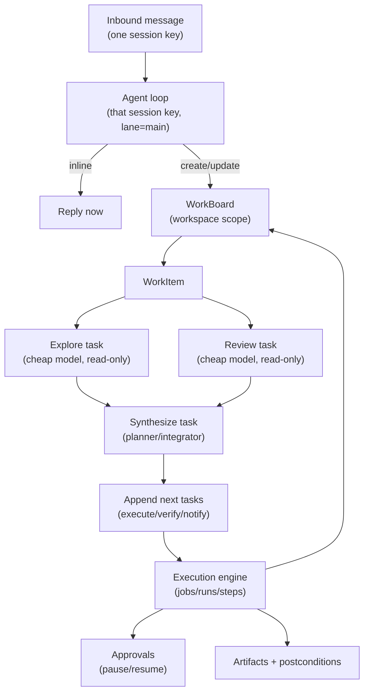

# Work board and delegated execution

The WorkBoard is Tyrum's workspace-scoped backlog and work-tracking system. It exists to keep interactive sessions (chat, and future low-latency audio) responsive while long-running work is planned and executed in the background.

The WorkBoard is a Kanban view over durable work state. A WorkItem can contain an internal task graph (a DAG) that the planner manages and the execution engine executes.

## Goals

- Keep channel-facing interactions low-latency by delegating long-running work to background runs/subagents.
- Make background work queryable from any channel or client (desktop app, Telegram, etc.) without relying on a specific session transcript.
- Prevent "one mega task" by sizing WorkItems, enforcing WIP limits, and making consolidation explicit.
- Preserve Tyrum's safety model: approvals, postconditions, artifacts, idempotency, and policy enforcement remain the enforcement layer.

## Non-goals

- Multi-operator coordination. Starting assumption: one operator per agent.
- Autonomous "learning" beyond explicit operator configuration.
- Replacing the execution engine. The WorkBoard sits above jobs/runs/steps as the work-management layer.

## Key concepts

### WorkBoard (workspace-scoped Kanban)

A WorkBoard is a durable backlog scoped to `(tenant_id, agent_id, workspace_id)`.

- It tracks WorkItems and their current state (Backlog/Ready/Doing/Blocked/Done/Cancelled).
- It enforces a WIP limit for `Doing` items (starting default: `2`).
- It is the primary place the interactive agent loop consults to answer "what are you working on?" and "status?" from any channel.

Kanban is a representation. The engine runs jobs/runs; the planner manages task graphs; the board summarizes outcomes and blockers.

### WorkItem (operator-facing unit of work)

A WorkItem is an operator-visible unit of work with a clear outcome and acceptance criteria.

WorkItems are sized to avoid the "everything merges into one card" failure mode:

- **Action WorkItem:** small, bounded, specific deliverable. Typically minutes to hours.
  - Example: "Schedule a meeting tomorrow morning with me and A."
- **Initiative WorkItem:** large and open-ended. It must be decomposed into smaller Action WorkItems before broad execution.
  - Example: "Implement this GitHub project end-to-end."

An Initiative WorkItem is allowed to produce a plan and spawn child WorkItems. It should not directly become a single sprawling fingerprint that absorbs unrelated work.

### Task graph (DAG) inside a WorkItem

Each WorkItem may have an internal task graph: nodes represent tasks, and edges represent dependencies.

- The planner creates and updates the graph as new information arrives.
- A work coordinator leases runnable tasks and dispatches them to an appropriate execution profile.
- Task completion is evidence-backed: artifacts + postconditions whenever feasible.
- A WorkItem's Kanban state is derived from the aggregate task state:
  - Blocked if any required approval is pending.
  - Doing if one or more tasks are leased/running.
  - Done only when acceptance checks pass and required evidence exists.

### Subagent (delegated execution context)

A subagent is a delegated execution context that shares the parent agent's identity boundary but has its own runtime context and transcript.

Starting semantics:

- Same `agent_id`, same workspace, same policy bundle and memory scope.
- Different `session_key` (so it does not serialize behind a channel-facing session).
- Subagent runs should normally execute in `lane=subagent`.
- An **execution profile** selects model, tool allowlist, budgets, and whether it is write-capable (distinct from provider auth profiles described in [Models](./models.md)).

In other words: a subagent is "the same agent, different session key + execution profile".

### Interactive agent loop (`lane=main`)

Each channel or client session has an interactive agent loop in `lane=main` that is tuned for responsiveness:

- It should reply quickly with either an inline answer or a WorkItem id.
- It should prefer delegation for tool-heavy or long-running work.
- It should answer status by querying WorkBoard state (not by replaying transcripts).

## Predictable intake and delegation

Delegation should be a deterministic policy step, not a model whim.

Standard work at intake:

1. **Classify:** inline response vs Action WorkItem vs Initiative WorkItem.
2. **Define acceptance:** minimal "done" criteria and required evidence (artifacts/postconditions).
3. **Estimate and budget:** timebox + cost budget per WorkItem and per task.
4. **Scope fingerprint:** record a bounded set of intended resources (repo/service/calendar/system) for overlap warnings (not auto-merge).
5. **Choose mode (reason-coded):**
   - `inline`: answer now, no background work.
   - `delegate_execute`: create Action WorkItem and dispatch executor/reviewer tasks.
   - `delegate_plan`: create Initiative WorkItem and dispatch planning tasks; child Action WorkItems are created from the plan.

Operator overrides should exist (slash commands / UI actions) to force a mode for predictability.

## Execution flow (fan-out, fan-in)

"Figure out what to do" is implemented as explicit fan-out tasks (often with different models/execution profiles) followed by a synthesis task that proposes next steps.

The WorkBoard is updated from durable execution outcomes (runs/steps/approvals/artifacts), not from chat narrative.

## Multi-channel status and notifications

### Status queries

The interactive agent loop should answer progress questions using WorkBoard state:

- "What is the status?" maps to `work.status(last_active_work_id)` or `work.list_active()`.
- Returned status should include: WorkItem state, running task summaries, blockers (especially approvals), latest artifacts, and a short next-step description.

This keeps status fast and predictable even when the active work is running in a different session key.

### Completion notifications (last active channel/session)

When a WorkItem changes state (Blocked/Done/Failed), Tyrum should notify the operator on the last active channel session (or last active client session when the operator is primarily interacting via a client):

- Track a durable `last_active_session_key` updated on inbound interactive activity (client or channel). This can be derived from durable session activity (transcripts/metadata) and optionally cached for fast routing.
- Each WorkItem stores `created_from_session_key` as a fallback route when `last_active_session_key` is not known.
- Notifications are outbound sends and must remain policy-gated (idempotent, auditable, approval-gated if required).

This supports "start work on desktop, ask for status on Telegram, receive completion back where you were last active".

## Backlog management (overlap and consolidation)

Multiple long-running WorkItems are expected. The WorkBoard prevents overload and thrash:

- **WIP limit (Doing):** default `2`. New items over the limit stay Ready/Backlog.
- **Overlap detection:** compare WorkItem fingerprints to warn about resource contention.
- **No auto-merge:** overlap produces an operator-visible choice (queue, link as dependency, or explicitly merge).
- **Explicit linking:** prefer dependency links (WorkItem B depends on A) over merging content into a single "blob" item.

## Profiles and permissions

Execution profiles bind model selection to tool/policy constraints (distinct from provider auth profiles, which describe credentials for a provider):

- `interaction` (interactive `lane=main`): fast, knowledge-rich model (not necessarily the cheapest); moderate deliberation settings to avoid high-latency reasoning; strict tool/time budget.
- `explorer` / `reviewer`: cheap model, read-only tool allowlist.
- `planner`: cheap/medium model, allowed to create/update task graphs and propose child WorkItems.
- `executor`: write-capable within workspace under strict leases; external side effects remain approval-gated.
- `integrator`: applies changes, runs verification, and produces final operator-facing summaries.

Spawning subagents and mutating the WorkBoard should be controlled by execution profile capabilities (for example `work.write`, `subagent.spawn`) plus quotas, not by convention.

## Data model sketch (durable state)

Exact schemas belong in `@tyrum/schemas`, but the durable record shapes are:

- `work_items(id, tenant_id, agent_id, workspace_id, kind, title, status, priority, created_at, created_from_session_key, last_active_at, fingerprint, acceptance, budgets, parent_work_item_id?)`
- `work_item_tasks(id, work_item_id, status, depends_on[], execution_profile, side_effect_class, run_id?, approval_id?, artifacts[], started_at, finished_at, result_summary)`
- `work_item_events(id, work_item_id, created_at, kind, payload_json)` (append-only audit trail for board state changes)
- `subagents(id, agent_id, workspace_id, execution_profile, session_key, status, created_at, last_heartbeat_at)`

## Events and observability

WorkBoard and subagents should emit events so operator clients can render a timeline:

- Work: `work.item.created`, `work.item.updated`, `work.item.blocked`, `work.item.completed`, `work.item.cancelled`
- Tasks: `work.task.leased`, `work.task.started`, `work.task.paused` (approval), `work.task.completed`
- Subagents: `subagent.spawned`, `subagent.updated`, `subagent.closed`

Each event should link back to durable identifiers (`work_item_id`, `task_id`, `run_id`, `approval_id`, artifact refs) so clients can rehydrate after reconnect.

## Safety integration

WorkBoard orchestration does not bypass Tyrum enforcement:

- Side effects still run through the execution engine with idempotency keys and retries.
- Approvals pause work safely and resume without re-running completed steps.
- State-changing work should be backed by postconditions and artifacts; unverifiable outcomes must block and escalate.

## See also

- [Execution engine](./execution-engine.md)
- [Approvals](./approvals.md)
- [Artifacts](./artifacts.md)
- [Workspace](./workspace.md)
- [Messages and Sessions](./messages-sessions.md)
- [Sessions and lanes](./sessions-lanes.md)
