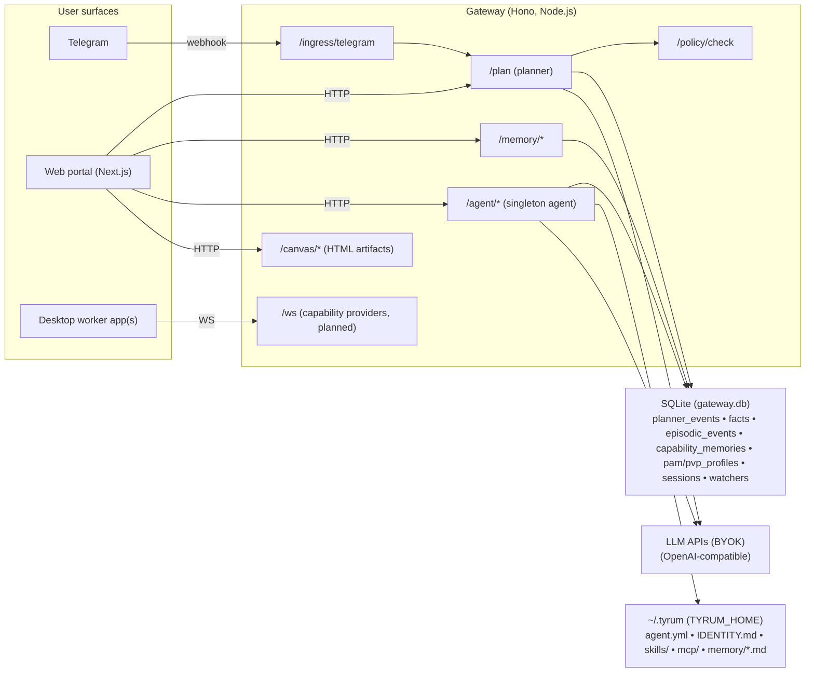

# Tyrum — Vision (Goal)

**Owner:** Ron Hernaus
**Working Title:** Tyrum
**Positioning:** Self-hosted autonomous worker agent (single-user)

---

## 1) Summary
Tyrum is a self-hosted **autonomous worker agent**: software that can take on roles typically handled by remote workers and execute tasks end‑to‑end with audit evidence. “Personal assistant” is simply the first role (default) rather than the product category.

The goal is for the worker to operate software **like a human would**, making it a drop-in replacement for many remote human workflows.

Tyrum is built for self-hosters and is intentionally **single-user per installation**. To run multiple workers, run multiple instances on separate machines (each with its own `TYRUM_HOME` and SQLite DB). The agent has a stable identity + role overlay, short-term **Sessions** keyed by `(channel, thread_id)`, and long-term memory (facts, episodic events, journal) designed to prevent repeating mistakes.

Guardrails (spend/PII/legal/explainability) are enforced outside the LLM prompt. Spend is **denied by default** until the user configures caps/permissions. Users interact via Telegram + desktop worker apps + a portal that exposes settings, an approval queue, and a live audit timeline. The goal is to operate software “like a human” while preferring structured interfaces when available and using web/desktop automation as fallback. LLM access is BYOK via OpenAI-compatible upstream APIs (no offline mode; no built-in local model requirement).

---

## 2) Differentiation
- **Role-first worker, not a chatbot.** The agent ships as a stable identity plus role overlays (e.g., Personal Assistant, Ops Coordinator).
- **No per-app plugin explosion.** Prefer structured interfaces when available and fall back to web/desktop automation when needed.
- **End-to-end with evidence.** Every state change produces artifacts (IDs, diffs, screenshots) and postconditions before “done” is claimed.
- **Mistake-proofing memory.** The system captures “lessons learned” and reuses them so the agent doesn’t repeat failures.

### Non-goals
- Not a multi-tenant SaaS.
- Not a general-purpose chatbot product.
- Not a captcha bypass tool and not built to evade website protections or ToS.
- Not an enterprise RPA suite (initially).
- Not an offline-first product (BYOK networked LLM access).

---

## 3) Core Principles
1. **Guardrails are wide but real.** A tiny constitution enforced *outside* the LLM:
   - No asset movement/commitments without recent consent or within explicit limits.
   - No new‑party PII sharing without consent.
   - Respect legal/channel rules.
   - Every action must be explainable in a human‑readable audit trail.
2. **Single-user, multi-instance.** Tyrum is a single-user product. Scale by running multiple instances on separate machines for multiple workers (not multi-tenant auth).
3. **Prefer structured interfaces; use web/desktop as fallback.** When multiple ways exist to do the same job, prefer the most structured, least brittle interface that is allowed by policy—while preserving the “operate like a human” UX (approvals, evidence, audit).

   Decision rule:
   - Choose the highest-ranked interface that is **allowed by policy**, **least-privilege**, and can produce **verifiable postconditions** at acceptable cost.
   - Prefer a **validated playbook** (reviewable DSL) when available; if no playbook exists, start with **dry-run probes** before mutating anything.
   - “Operate like a human” is a user experience guarantee (approvals, evidence, takeover), not a requirement to use pixel-driving when a safer structured contract exists.

   Default interaction preference (skip anything not allowed / not available):
   1) **Native capability provider (“plugin”)** — out-of-process, scoped, auditable providers (e.g., MCP servers, desktop worker apps). Avoid in-process per-app plugins.
   2) **CLI** — great for local/dev work when it produces stable, machine-verifiable artifacts; for SaaS workflows, prefer structured contracts over CLI wrappers.
   3) **Structured contract (SDK/API)** — treat SDK + API as one bucket; prefer the more typed/explicit/least-privilege path for the operation.
   4) **Web UI automation (Playwright)** — operate the same web UI a human uses, using DOM/a11y signals and explicit postconditions.
   5) **Desktop screen control** — last-resort pixel-level control when web automation is unavailable or unreliable.
4. **Evidence over confidence.** “Done” requires postconditions + artifacts, not narrative.
5. **Memory over code (but memory is never runtime code).** Preferences, selectors, and “lessons learned” are **remembered**, not hard-coded — with a hard constraint:

   - Memory may propose parameters, heuristics, and playbooks.
   - Memory may not introduce new executable logic beyond a constrained playbook DSL/schema and the typed action primitives in `@tyrum/schemas`.

   If behavior needs “new logic”, it must be expressed as a reviewable playbook artifact (diffable, schema-validated) or as code — not as prompt-shaped instructions hidden in long-lived memory.
6. **Ask when unsure.** Low-confidence autonomy → concise confirmation; teach-back → persist the rule.
7. **Tool minimization.** The model sees only a small, retrieved set of affordances relevant to the goal (no huge tool lists in prompts).

---

## 4) User Experience
- **Interfaces:** Telegram + desktop worker app(s) + web portal. Other channels are optional later and must respect policy.
- **Modality:** text first; voice is optional later.
- **Proactivity:** follow-ups, scheduling conflicts, inbox nudges, “waiting on” reminders, etc.
- **Consent UX:** one-tap approvals with clear cost/impact; “ask once per vendor” and spend caps supported; controls mirror the live activity feed so users can pause or escalate any plan.
- **Approval notifications:** if an approval is pending, notify the user (Telegram) with inline **Approve/Deny** plus a deep link into the approval queue.
- **Live activity feed:** real-time timeline showing planner intents, policy checks, and executions with pause/hold controls for each step.
- **Canvas outputs:** rich, shareable HTML views (receipts, dashboards) rendered in the portal and backed by gateway `/canvas/*` artifacts.
- **Dry-run / read-only mode:** before executing, show the plan + touched accounts/domains/apps + estimated cost/time; run read-only probes when possible (locate elements, check auth state) without mutating anything.
- **Human takeover (pause + drive):** users can pause execution, see exactly what the executor sees, take control for tricky steps (login/2FA/captcha/weird forms), then hand control back.
- **Flow recorder + playbook editor:** “show Tyrum once”: record a human run, auto-extract selectors/screenshots/postconditions, then review and save a runnable playbook artifact.
- **Editable permissions:** User-facing console to adjust watchers, spend caps, data scopes, and executor access at any time.
- **Import/export:** backup/restore (`gateway.db` + `~/.tyrum`), export evidence bundles, export playbooks, export memory, and “forget X” that deletes related artifacts too.
- **Rollback when possible:** every state-changing step includes rollback info when it exists (and whether rollback requires approval). Some actions are fully reversible (draft edits), some are conditionally reversible (cancel order if vendor allows), and some are not reversible (bank transfers).
- **Explainability:** “I ordered from Place X because no public API was found; last two flows succeeded; total €27, 3DS approved at 18:12.”

---

## 5) Architecture (high level)


**Gateway:** A single local-first process that hosts planner, policy checks, memory APIs, Telegram ingress, and optional agent routes. The default profile is single-user and binds to localhost.

**Safe-by-default when exposed:** if the gateway is bound to a non-local interface (or otherwise reachable outside the host), authentication must be required. A gateway admin token is generated automatically if none exists and is shown once during setup; the portal also surfaces a prominent “you are exposed” banner until auth is confirmed.

**Agent runtime:** A singleton agent that reads identity/config/skills from `~/.tyrum`, keeps short-term context in `sessions` (SQLite), and optionally writes narrative memory to markdown files.

**LLM backend:** BYOK via an OpenAI-compatible upstream API.

**Canvas:** An optional HTML artifact surface (served under `/canvas/*`) for rich, shareable outputs (receipts, dashboards) rendered in the portal and referenced from audit trails.

**Desktop worker app(s):** Capability providers that expose “human-like” desktop control (screen, keyboard/mouse, local apps) to the gateway over WebSocket. This is required for robust UI automation fallback, but the WebSocket runtime is still being wired up.

**Execution engine (job runner):** The long-running task system that turns plans/playbooks into resilient execution: a queue, retries, concurrency limits, budgets/timeouts, idempotency, pause/resume, and “human takeover” handoffs. It is the backbone for trustworthy end-to-end work (not just chat responses).

### Local Workspace Layout (singleton)
Default home: `~/.tyrum` (override with `TYRUM_HOME`).

```
~/.tyrum/
  agent.yml
  IDENTITY.md
  skills/<skillId>/SKILL.md
  mcp/<serverId>/server.yml
  playbooks/<playbookId>/playbook.yml
  memory/
    MEMORY.md
    <iso-day>.md
```

**What lives here (current):**
- `agent.yml` — singleton config (model, enabled skills/MCP, tool allowlist, session limits, markdown memory toggle)
- `IDENTITY.md` — identity frontmatter + system prompt body
- `skills/*/SKILL.md` — prompt-only, declarative skills (no in-process plugin code)
- `mcp/*/server.yml` — local MCP server specs (stdio)
- `playbooks/*` — reviewable workflow specs (git-friendly) produced by the flow recorder + editor
- `memory/*` — narrative memory files written by the agent runtime

**Runtime flags (current):**
- `TYRUM_AGENT_ENABLED=1` enables `/agent/status` and `/agent/turn`
- `GATEWAY_HOST`, `GATEWAY_PORT`, `GATEWAY_DB_PATH` control gateway bind and SQLite location

### Technology Stack (current repo / local-first profile)
- **Runtime:** Node.js 24.x
- **Language:** TypeScript (strict, ESM)
- **Gateway:** Hono (+ Node `http.createServer()` for HTTP + WebSocket upgrades)
- **Validation/types:** Zod (`@tyrum/schemas`)
- **Database:** SQLite (`better-sqlite3`) + migrations
- **Event bus:** `mitt` (in-process)
- **Portal:** Next.js 16.1.x + React 19.2.x
- **Build:** `tsdown`
- **Lint:** `oxlint` (repo), ESLint (portal)
- **Tests:** Vitest

> Tyrum is intentionally single-user. To run multiple workers, run multiple instances on separate machines (each with its own `TYRUM_HOME` + DB).

---

## 6) Capability Discovery (no skills list)
**Goal:** Prefer structured interfaces when available; fall back to web/desktop UI automation with explicit postconditions.

- Provider names (e.g., Gmail vs Outlook) are first-class in UX, audit, and memory, but the default strategy does not rely on provider-specific APIs or per-app plugins.
- Execution surface selection: prefer structured interfaces (capability providers, CLI, SDK/API) when allowed; then web UI automation; then desktop screen control.
- “Discovery” is primarily selecting the best surface and reusing known-good flows from playbooks + capability memory (including reliability/drift signals).
- Default behavior prefers: **use an existing validated playbook** → **dry-run probes** → **execute** → **record/repair playbook** (with human review).

**Current repo state (local-first profile):**
- Discovery is a pipeline skeleton with an in-memory cache; it currently returns empty resolutions in the default runtime.
- The agent runtime can load enabled MCP server specs from `~/.tyrum/mcp/*/server.yml` and surface them in the tool directory, but MCP tool invocation and network probing are roadmap items.

**Optional future optimizations:** `try_mcp() → try_cli() → try_structured_connectors() → try_generic_http() → web → desktop`
- **MCP:** start local stdio servers; treat as untrusted until scopes are granted; cache success.
- **Structured connectors:** IMAP/SMTP, CalDAV, or provider APIs can reduce latency and token cost, but must not change the user-facing behavior.
- **Generic HTTP:** authenticated basic calls if discovered (schemas generated on the fly).
- **Automation fallback:** robust Web/App automation using accessibility roles and explicit postconditions.

All successful paths are stored as **capability memory** (what worked, known costs, selectors, anti‑bot quirks) and reused.

---

## 7) Planner: neutral plan/trace (not domain skills)
Use a minimal set of **universal action primitives** to enable auditability, retries, and consents without introducing domain APIs.

> **Current repo state:** `/plan` is a planner skeleton that demonstrates request/response envelopes, policy + wallet guardrails, and audit logging. Real executor loops and connector discovery are roadmap items.

**Primitives (examples):**
- `Research(query|url) → observations`
- `Decide(options|policy|memory) → choice`
- `Web(action[, postcondition])`
- `Desktop(action[, postcondition])`
- `CLI(action[, postcondition])`
- `Http(request[, postcondition])`
- `Message(send|draft)`
- `Pay(amount, merchant, instrument, postcondition)`
- `Store(memory_update)`
- `Watch(event_source, predicate, reaction_plan)`
- `Confirm(summary, cost, risk)`

**Postconditions are mandatory** on state‑changing steps to avoid silent failure (the canonical primitive kind list lives in `@tyrum/schemas`, which also exposes a `requiresPostcondition(kind)` helper).

**Agent tools (IDs, allowlisted):** Separate from planner primitives, the agent runtime may expose a small set of tool IDs to the model, gated by policy + `agent.yml` allowlists (e.g. `tool.fs.read`, `tool.fs.write`).

**Dry-run is first-class (design target).** Any plan can be previewed and (when possible) executed as read-only probes: navigate, detect auth state, locate key elements, and estimate feasibility/cost without mutating external state.

**Rollback is explicit (design target).** Mutating steps carry rollback metadata when available (instructions, conditions, and whether rollback requires approval). The execution engine uses this to set expectations and to fail safely when rollback is impossible.

### Planner request/response contract
Planner clients exchange the shared `PlanRequest` and `PlanResponse` types from `@tyrum/schemas`
to keep policy, planner, and API services aligned on envelopes and error handling. Optional hints such as
`locale` or `timezone` may be omitted when the caller has no preference.

**Request Example (`PlanRequest`):**
```json
{
  "request_id": "req-8f5080c4",
  "trigger": {
    "thread": {
      "id": "219901",
      "kind": "private",
      "username": "alex",
      "pii_fields": ["thread_username"]
    },
    "message": {
      "id": "77881",
      "thread_id": "219901",
      "source": "telegram",
      "content": {
        "kind": "text",
        "text": "Can you book a tasting at EspressoExpress for next Friday?"
      },
      "sender": {
        "id": "8722",
        "is_bot": false,
        "first_name": "Alex",
        "username": "alex",
        "language_code": "en"
      },
      "timestamp": "<iso_timestamp>",
      "pii_fields": ["message_text", "sender_first_name", "sender_username"]
    }
  },
  "locale": "en-US",
  "timezone": "America/Los_Angeles",
  "tags": ["telegram", "pilot"]
}
```

**Response Example — Success (`PlanResponse`):**
```json
{
  "plan_id": "plan-e0c44e4f",
  "request_id": "req-8f5080c4",
  "created_at": "<iso_timestamp>",
  "trace_id": "trace-bee4",
  "status": "success",
  "steps": [
    {
      "type": "Research",
      "args": {
        "intent": "look_up_availability",
        "query": "EspressoExpress Friday tastings"
      }
    },
    {
      "type": "Message",
      "args": {
        "channel": "email",
        "recipient": "reservations@espressoexpress.example",
        "body": "Please confirm a tasting for Friday at 18:00."
      },
      "postcondition": {
        "status": "delivered"
      }
    }
  ],
  "summary": {
    "synopsis": "Gather options and send a confirmation email"
  }
}
```

**Response Example — Escalate (`PlanResponse`):**
```json
{
  "plan_id": "plan-7c52d8a1",
  "request_id": "req-8f5080c4",
  "created_at": "<iso_timestamp>",
  "status": "escalate",
  "escalation": {
    "step_index": 1,
    "action": {
      "type": "Confirm",
      "args": {
        "prompt": "Approve €85 tasting fee at EspressoExpress?",
        "context": {
          "merchant": "EspressoExpress",
          "amount": {
            "currency": "EUR",
            "value": 85
          }
        }
      }
    },
    "rationale": "Spend cap requires explicit approval",
    "expires_at": "<iso_timestamp>"
  }
}
```

**Response Example — Failure (`PlanResponse`):**
```json
{
  "plan_id": "plan-36d940c7",
  "request_id": "req-8f5080c4",
  "created_at": "<iso_timestamp>",
  "status": "failure",
  "error": {
    "code": "policy_denied",
    "message": "Payment exceeds approved budget",
    "detail": "Wallet tyrum: monthly dining cap of €200 would be exceeded",
    "retryable": false
  }
}
```

---

## 8) Memory System
Tyrum persists operator knowledge in three layers:
- **Structured state** (SQLite)
- **Narrative memory** (markdown)
- **Playbooks** (reviewable workflow specs; not “memory as code”)

**Structured (SQLite, `gateway.db`):**
- **Facts (`facts`):** canonical truths (names, addresses, IDs, vendor prefs, budgets).
- **Episodic events (`episodic_events`):** messages, attempts, outcomes; event‑sourced.
- **Capability memory (`capability_memories`):** selectors, flows, success/failure patterns per site/app.
- **Profiles (`pam_profiles`, `pvp_profiles`):** autonomy/consent defaults (PAM) and persona/voice settings (PVP).
- **Sessions (`sessions`):** short-term context per `(channel, thread_id)` with bounded turns + TTL cleanup.

**Narrative (markdown under `TYRUM_HOME`):**
- `~/.tyrum/memory/MEMORY.md` — durable preferences/procedures (“identity-level memory”) and “lessons learned” rules. This file must remain human-reviewable text and must not become executable logic.
- `~/.tyrum/memory/<iso-day>.md` — append-only daily journal entries

**Retention:**
- Facts, episodic events, and markdown memory are retained indefinitely by default.
- Sessions are short-term by design and may expire via TTL.
- Future work adds compaction/summarization and pruning tools to keep memory useful (not just large).

**Planned / reserved:**
- **Vector recall** for semantic retrieval (schema exists; embedding + retrieval pipeline is not yet wired in the local-first profile).

### Playbooks (first-class, reviewable workflows)
**Playbook = reviewable, diffable, exportable workflow spec.** This is the primary mechanism for “show Tyrum once, then it can do it reliably” — without turning memory into runtime code.

- **Storage (git-friendly):** `~/.tyrum/playbooks/<playbookId>/playbook.yml` (plus optional `artifacts/` for screenshots, DOM snapshots, and receipts).
- **What a playbook contains (high level):**
  - steps (typed primitives + executor kind)
  - allowed domains/apps (explicit allowlists)
  - required postconditions (including explicit “auth state” checks)
  - failure handling + rollback hints (and whether rollback needs approval)
  - consent boundaries (what can happen without asking, spend limits, PII constraints)
  - provenance notes (“this was recorded from a human run”, “last validation result: passing/failing”)
- **Invariant:** Playbooks are validated by a constrained schema/DSL. They can parameterize and branch only through declared, reviewable constructs. No arbitrary code execution and no “prompt-shaped code” embedded in long-lived memory.

#### Flow recorder + playbook editor (killer feature)
- **Recorder:** capture a human completing a task via web/desktop executor (flight recorder): UI events, URLs/apps, DOM/a11y snapshots, key screenshots, and observed outcomes.
- **Extractor:** propose selectors, candidate postconditions, and safe defaults (domains/apps allowlist, idempotency keys, rollback suggestions).
- **Editor:** user reviews and edits the playbook before it becomes runnable (diffable changes, schema validation, linting).
- **Runtime use:** the execution engine prefers a validated playbook when one exists; if a playbook fails, it either requests human takeover or falls back to structured interfaces / safe probes.

#### Capability health + drift detection (playbook-centric)
- Track per-playbook reliability: success/failure counts, last success, average duration, typical failure modes, and cost envelopes.
- Run scheduled read-only smoke checks (“can we still find key elements?”, “are we logged in?”) to detect UI drift early.
- Alert with actionable repair requests: “Inbox layout changed; playbook needs repair.”

### Capability memory schema & usage
- Table: `capability_memories` (primary key `id`) keyed by the unique tuple
  `(capability_type, capability_identifier, executor_kind)` in the single-user runtime. Each
  row captures selectors, executor wiring, and outcome metadata for a successful
  run so the planner can rehydrate a known-good flow.
- Indexes: `(capability_type)` for lookups during planning, plus an index on
  `last_success_at DESC` to promote freshest memories.
- Fields:
  - `selectors` – JSON blob with DOM/API selector hints. Treat this as PII‑adjacent:
    redact literal handles, emails, or account numbers before persisting and only
    store hashed or templated selectors that the executor can safely reuse.
  - `outcome_metadata` – structured JSON storing postconditions, receipts, or
    other artifacts that prove the run succeeded.
  - `cost_profile` – vendor cost envelope (currency, observed minor units,
    timestamps) so planners can estimate spend before replaying a flow.
  - `anti_bot_notes` – executor-facing notes describing captcha/rate-limit
    quirks and the mitigations that previously worked.
  - `success_count`, `last_success_at`, `result_summary` – track reliability and
    provide operator context when reviewing audit trails.
- Subject scoping and access controls are deployment-profile concerns; the local-first profile is single-user and does not carry subject IDs.

---

## 9) Policy & Guardrails
- **Policy engine** (not prompt‑only; currently exposed as `POST /policy/check` in the gateway) enforces:
  1) No asset movement or commitments without explicit consent or within user‑set limits.
  2) No PII to new parties without consent.
  3) Respect legal/channel ToS (e.g., WhatsApp 24‑hour windows, GDPR export/delete).
  4) Explainability: every action must have a human‑readable why/what/source.
- **Profiles (user-configured):** `Safe`, `Balanced`, `PowerUser` control default escalation/approval behavior.
- **Spend defaults:** No caps are preconfigured; spending is **disabled** until configured.
- **Everything else is learned** (PAM) or asked once, then remembered.

---

## 10) Payments & Commitments
- **Current repo state:** a wallet authorization stub demonstrates spend guardrails and escalation/denial flows in the planner skeleton.
- **Future — user-provisioned virtual card:** Users generate a virtual card with their bank/issuer and securely share the card details; Tyrum stores it in secure secret storage and uses it on their behalf within explicit spend limits. Tyrum never issues cards directly.
- **SCA/3DS** handled in-chat; OTP approvals flow through the user’s channel.
- **Budget rules** in PAM (e.g., “auto food < €40 in home city”). Unknown → `Confirm(...)`.
- Prefer vendor APIs; fallback to Web/App checkout with strong postconditions (order #, email receipt).

---

## 11) Watchers & Proactivity (without types)
- **Event sources:** email, messages, calls, calendar, files, webhooks (delivery/order), custom signals.
- **Predicate:** natural-language or DSL compiled to a check (e.g., overlaps ≥ 15 min, ETA slip ≥ 20 min, unanswered VIP email ≥ 24 h).
- **Reaction:** a small plan built from the same primitives (notify, rebook, reschedule).
- The agent proposes/updates rules; user can tweak or disable any watcher.
- Registrations persist to the `watchers` SQLite table in the local-first profile. A watcher processor skeleton exists (event-bus driven) but is not yet wired into the default runtime; periodic triggers require a scheduler.
- Self-hosted profile defaults to a single-user localhost-only deployment with required gateway token auth; if exposed, also require explicit network boundaries (reverse proxy / VPN).
- Portal routes require auth in local and exposed modes, with clear operator warnings when exposure is detected.

---

## 12) Persona & Voice
- **PVP is editable anytime.** Sliders for tone, verbosity, initiative; per‑context adapters (work vs family).
- **Voice:** selectable TTS/clone (with explicit consent), pace/pitch/warmth; per‑contact pronunciation dictionary.
- **90‑second calibration** at onboarding (Appendix E).
- **Safety:** voice cloning only with consent; easy rollback to prior settings.

---

## 13) Auditability & Observability
- **Audit log (current):** append-only `planner_events` in SQLite (`gateway.db`) records planner decisions; agent turns also write episodic events to `episodic_events`.
- **Target trace shape:** `Message → Plan → Policy Checks → Actions → Observations → Outcome → Cost`, with short rationales attached to steps (facts/sources only).
- **Tamper-evident audit log (design target):** each audit event includes a hash of the previous event (hash chain). Optionally sign the chain with a local key. Support exporting a **receipt bundle** (JSON + referenced artifacts) suitable for sharing with a human or attaching to an issue.
- **Observability (planned):** OpenTelemetry; SLOs for latency (< 2.0 s for text replies when possible), success rate, consent prompts avoided, proactive saves, and token/cost attribution once executors land.
- **Repro (future):** keep selectors/requests/artifacts needed to replay flows in a sandboxed environment.

---

## 14) Security & Privacy
### Trust model / threat model (explicit)
**Trusted components:**
- Gateway + execution engine (job runner)
- Executors/capability providers (web, desktop, CLI, MCP servers) *only within explicitly granted scopes*
- Policy engine + approval system
- Secret Provider

**Untrusted inputs (treat as data, not instructions):**
- Email bodies and attachments
- Web pages, rendered DOM text, and downloaded files
- Messages from coworkers/customers and any third-party content

**Forbidden behaviors:**
- Treating untrusted content as instructions (“the email told me to wire money”).
- Exfiltrating secrets/PII to logs, the model, or third parties without consent.
- Performing irreversible or high-risk actions without required approvals.

### Safe-by-default exposure (no “localhost-only” footguns)
- Bind to localhost by default.
- Require gateway authentication on localhost and non-local interfaces.
- Generate a gateway admin token automatically if none exists; show it once during setup (one-time view) and store it via the Secret Provider.
- Portal shows a prominent banner when exposure is detected (“you are reachable outside localhost; auth is required”).

### Secret boundary: “agent never sees raw credentials”
- Introduce a first-class **Secret Provider** capability (out-of-process, scoped):
  - OS keychain / encrypted local file
  - Bitwarden / 1Password via provider
  - one-time view secrets during setup
- Executors receive **secret handles**, not raw secret values; the model never receives raw credentials.
- Strict logging redaction for secrets and PII by default; opt-in debug modes must still redact.

### Prompt/tool injection defenses (email + web are adversarial)
- Add **data provenance** tags to observations (`source=user|email|web|tool`) and carry them through the trace.
- Never treat scraped/received text as instructions; label it as untrusted data in prompts.
- Policy engine blocks tool calls justified only by untrusted instructions; spending/commitments require user-confirmed intent.
- Automatic redaction of secrets/PII from any content sent to the model when feasible.
- Executor network controls: outbound domain allowlists and explicit egress policies (fail closed).

### Execution isolation (design target)
- Web/desktop/CLI executors run with least privilege and explicit egress policies; no “silent” side effects without audit evidence.
- Cookie/session vault with explicit expiry metadata; “auth state detector” postconditions (“are we logged in?”) are first-class.

---

## 15) Roadmap (Telegram + desktop-first, local-first)

### 15.1 Next milestones (proposed)
1) Safe-by-default exposure: gateway auth token (auto-generated) + force auth on non-local binds + “exposed” banner and setup wizard.
2) Ship a real approval queue + notifications + dry-run previews: show plan, touched accounts/domains/apps, and estimated cost/time; support one-tap Approve/Deny with deep links.
3) Flow recorder + playbook editor + playbook runner: “show Tyrum once”; store reviewable artifacts in `~/.tyrum/playbooks/*`.
4) Web + desktop executors with artifacts + postconditions + **human takeover** (pause + drive), optimized for common knowledge-worker workflows.
5) Wire the WebSocket runtime (`/ws`) and implement `tool.node.dispatch` so desktop worker apps can provide screen/keyboard/mouse capabilities.
6) Secret Provider + secret handles + redaction pipeline so the agent never sees raw credentials.
7) Tamper-evident audit log (hash chain) + exportable receipt bundles + import/export + “forget X” that deletes artifacts.
8) Capability health + drift detection: reliability scores, smoke tests, and repair UX.
9) Add watcher scheduler + proactivity queue; start with inbox follow-ups, pending approvals, and calendar conflict nudges.

### 15.2 CLI executor sandbox (design target)
- Runs commands inside an isolated workspace volume with directory traversal blocked at the boundary; refuses to operate if the contract is broken.
- Default outbound network access disabled; any allowlist must be explicit and auditable.
- Mutating steps require postconditions based on stdout/stderr or explicit artifacts so the audit trail stays reproducible.

---

## 16) Risks & Mitigations
- **UI drift/auth churn:** UI automation is brittle; mitigate with accessibility-first selectors, strict postconditions, artifact capture, capability health scores, drift alerts, and human takeover for re-authentication.
- **Captcha + anti-bot:** do not position Tyrum as “bypass captcha.” Mitigate with human takeover, structured interfaces where worth it, and clear “cannot proceed without human” outcomes.
- **2FA churn:** sessions expire constantly; mitigate with auth-state postconditions, a cookie/session vault with explicit expiry metadata, and takeover-first UX for login flows.
- **Prompt/tool injection:** email + web are adversarial. Mitigate with provenance-tagged observations, “content is data” prompt formatting, policy keyed to provenance, and deny-by-default tool policies for irreversible actions.
- **Exposure footguns:** users will publish localhost services. Mitigate with forced auth on non-local binds, one-time admin token setup, and prominent portal warnings when exposed.
- **Latency/cost:** UI automation is token-hungry; mitigate with DOM/a11y extraction, state diffs, caching, and smaller models for routine classification.
- **Credential safety:** self-hosted automation still touches real accounts; mitigate with Secret Provider boundaries (handles, not raw secrets), strict redaction, and least-privilege scopes.
- **Memory-as-code drift:** “prompt-shaped code” becomes unreviewable. Mitigate with the invariant: durable workflows live in schema-validated playbooks, not in free-form memory.
- **Memory bloat:** unlimited retention can degrade retrieval; add compaction/summarization and relevance scoring before it becomes a reliability problem.

---

## 17) Success Metrics (examples)
- Time‑to‑first‑value < 5 minutes.
- Confirmation rate decreases over time (learned autonomy).
- Proactive saves per user per month (conflict avoided, rebooking, bill avoided).
- Flow reliability (postcondition pass rate) > 97%.
- Playbook adoption: “show once” → reliable replay with minimal edits.
- Drift response: smoke tests detect breakage early; repair turnaround is short and measurable.
- Human takeover rate decreases over time (without reducing success rate).
- Audit integrity: hash-chain verification succeeds; receipt bundles are exportable and complete.
- Secrets/PII leakage incidents: 0 (no raw credentials in model context or logs).
- Net cost per successful task within target (€).

---

## 18) Data Entities (sketch)
`Installation (single-user), Identity(Channel, Handle), Credential(Provider, Scopes), Consent(Scope, Confidence), Session, Thread, Message, Plan, Step, ToolCall, Observation, Artifact, Memory(Fact|Episodic|Vector|Capability|PAM|PVP|Markdown), Trigger(EventSource, Predicate, Reaction), Transaction, AuditEvent`.


---

## Appendix A — Action Primitive Schema (minimal)
```json
{
  "$schema": "http://json-schema.org/draft-07/schema#",
  "title": "ActionPrimitive",
  "type": "object",
  "properties": {
    "type": {"type": "string", "enum": [
      "Research","Decide","Web","Desktop","CLI","Http","Message","Pay","Store","Watch","Confirm"
    ]},
    "args": {"type": "object"},
    "postcondition": {"type": ["object","null"]},
    "idempotency_key": {"type": "string"}
  },
  "required": ["type","args"],
  "additionalProperties": false
}
```

**Postcondition examples:** DOM/text assertion, HTTP status/body predicate, email receipt detected, calendar diff exists.

---

## Appendix B — Persona & Voice Profile (PVP) Schema (example)
```json
{
  "tone": {"type": "string", "description": "calm|energetic|witty|formal|playful"},
  "verbosity": {"type": "string", "description": "terse|balanced|thorough"},
  "initiative": {"type": "string", "description": "low|medium|high"},
  "consent_style": {"type": "string", "description": "ask_first|ask_once_per_vendor|act_within_limits"},
  "emoji_gifs": {"type": "string", "description": "never|sometimes|often"},
  "language": {"type": "string"},
  "context_rules": [{"context": "work|family|friends", "overrides": {}}],
  "voice": {
    "voice_id": "string",
    "pace": "number",
    "pitch": "number",
    "warmth": "number",
    "pronunciation_dict": [{"token": "string", "pronounce": "string"}]
  }
}
```

---

## Appendix C — MCP Discovery (minimal spec)
1) Try linked endpoints from user accounts or `.well-known/mcp`.
2) If found, fetch capability list, auth methods, scopes, rate limits, and side‑effects.
3) Present to policy gate for scope grant; cache on success.
4) If policy escalates or denies, emit a `requires_consent` discovery outcome so the planner can prompt the user.
5) If not found, silently continue down the discovery chain.

---

## Appendix D — Watchers (examples)
- **Calendar overlap:** `predicate: overlaps(event_a, event_b) >= 15m` → `reaction: propose new slots; if under limit, reschedule`.
- **VIP email idle:** `predicate: from in VIP && no_reply >= 24h` → `reaction: draft reply + notify`.
- **Delivery slip:** `predicate: eta_slip >= 20m` → `reaction: contact vendor + notify`.

---

## Appendix E — 90‑Second Calibration Script (Telegram)
1) *Tone check:* “Prefer more upbeat or more neutral?”
2) *Verbosity:* “Short and crisp, or thorough by default?”
3) *Initiative:* “Ask before acting, ask once per vendor, or act under limits?”
4) *Quiet hours:* “When should I avoid non‑urgent messages?”
5) *Spending:* “Safe to auto‑approve everyday buys under €X in your area?”
6) *Voice sample:* send two short audio styles → “Which do you prefer?”
7) Store PVP + PAM; confirm: “Change anytime: *‘be more concise’*, *‘use fewer emojis’*, *‘stop auto approvals’*.”

---

## Appendix F — Sample Audit Event
```json
{
  "trace_id": "a1b2c3",
  "plan_id": "plan-36d940c7",
  "request_id": "req-8f5080c4",
  "channel": "telegram",
  "session_id": "telegram:219901",
  "steps": [{"type":"Web","args":{"navigate":"https://placex.com"},"postcondition":{"contains_text":"Menu"}}],
  "policy_checks": [{"rule":"spend_limit","result":"ok","limit_minor_units":4000,"amount_minor_units":2780,"currency":"EUR"}],
  "actions": [{"executor":"Web","result":"ok","evidence":{"screenshot":"artifact://run/step-0.png"}}],
  "outcome": {"status":"success","summary":"Ordered two bowls, €27.80"},
  "cost": {"llm_tokens": 1432, "exec_time_ms": 4120},
  "timestamp": "<iso_timestamp>"
}
```

---

## Appendix G — Cost Controls
- Route intent/risk classification to small local models.
- Cache API schemas and successful flows.
- Retrieve only top‑k tools per task.
- Cache discovery outcomes in-process in the local-first profile; scale-out profiles can introduce Redis or a dedicated cache with explicit TTLs and metrics.
- Batch background enrichment and summarization.
- Enforce per-installation spend/compute quotas with graceful degradation.

---
